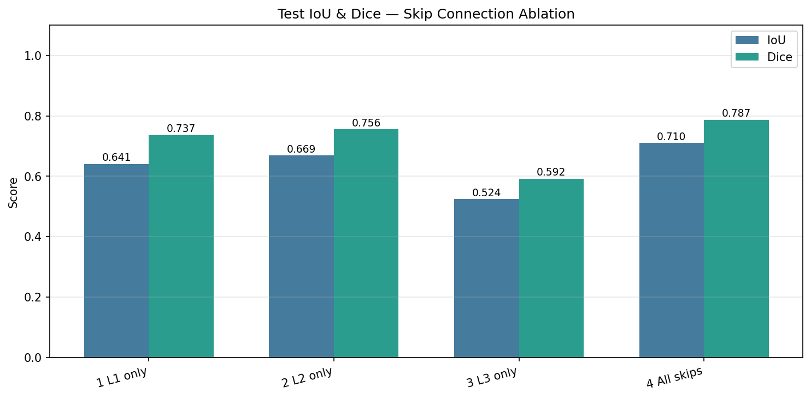
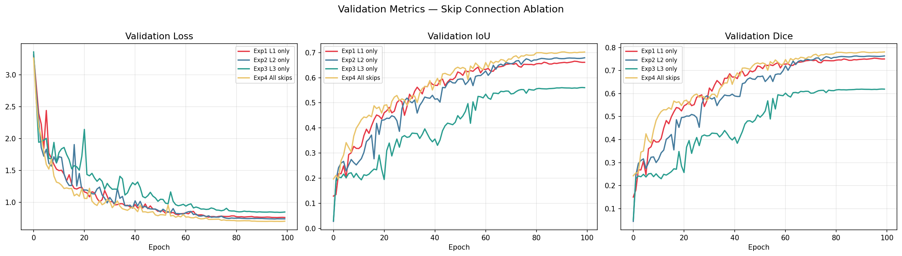
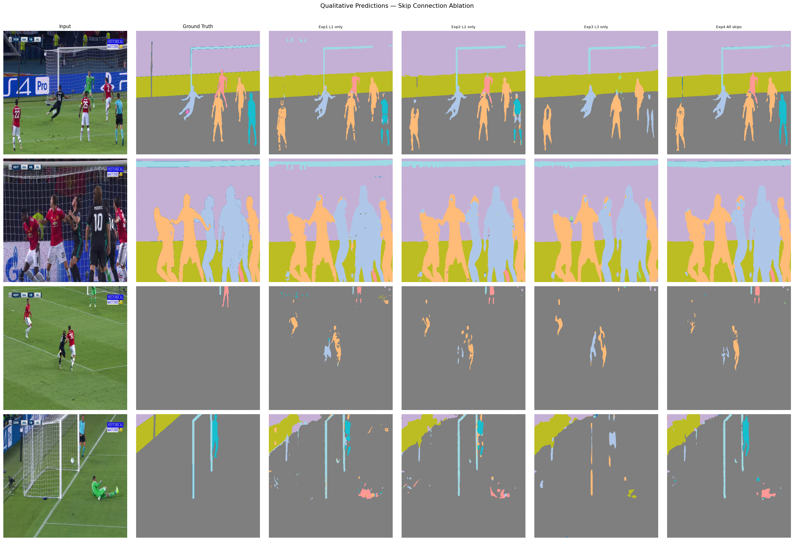

# U-Net Skip Connection Ablation — Football Semantic Segmentation
Ablation study on a 3-level U-Net, testing how each skip connection level affects segmentation quality on broadcast football footage (COCO-format dataset).

## Setup
- **Dataset:** [Football Semantic Segmentation](https://www.kaggle.com/datasets/sadhliroomyprime/football-semantic-segmentation) (COCO format), 100 images, 512×512
- **Split:** 80 train / 10 val / 10 test
- **Model:** 3-level U-Net (64→128→256ch), skip connections toggleable per level
- **Metrics:** IoU (Jaccard), Dice coefficient
- **Training:** 100 epochs, Adam, CosineAnnealingLR, CrossEntropyLoss

## Experiments
| Exp | Skip connections active |
|-----|--------------------------|
| 1   | Level 1 only (shallowest — 64ch, 512×512) |
| 2   | Level 2 only (middle — 128ch, 256×256) |
| 3   | Level 3 only (deepest — 256ch, 128×128) |
| 4   | All levels (standard U-Net) |

## Results
| Experiment | L1 | L2 | L3 | Test IoU | Test Dice |
|------------|:--:|:--:|:--:|:--------:|:---------:|
| Exp 1 — L1 only   | ✔ | ✘ | ✘ | 0.6410 | 0.7367 |
| Exp 2 — L2 only   | ✘ | ✔ | ✘ | 0.6686 | 0.7556 |
| Exp 3 — L3 only   | ✘ | ✘ | ✔ | 0.5244 | 0.5919 |
| **Exp 4 — All skips** | ✔ | ✔ | ✔ | **0.7101** | **0.7870** |

## Conclusion
Results match standard U-Net theory: the full model with all three skip connections (Exp 4) gets the best score on both IoU and Dice, training the most smoothly with no sign of overfitting. Among single-skip variants, the middle level (Exp 2) keeps the most useful detail, followed by the shallow level (Exp 1), while the deepest skip alone (Exp 3) performs worst — likely because most fine spatial detail is already lost by that depth.

**For this dataset, the standard full-skip U-Net (Exp 4) is the best choice to deploy.**

Note: the test set is small (10 images) and each experiment ran once, so the exact margins should be treated as indicative rather than final. A larger test set and multiple seeds per config would make the ranking more robust.

## Files
- `semantic-segmentation.ipynb` — full notebook (data loading, model, training, evaluation)
- `ablation_results.csv` — results table
- `training_curves.png`, `bar_chart.png`, `predictions.png` — output figures
